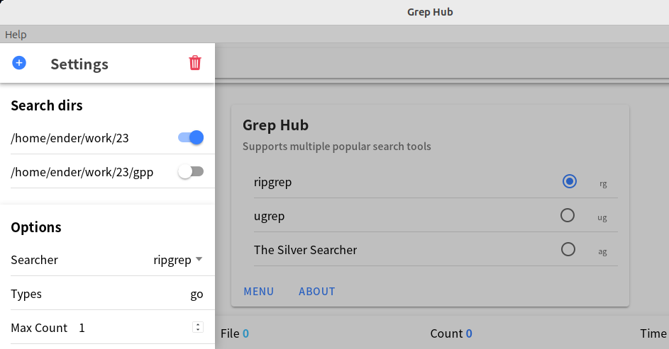
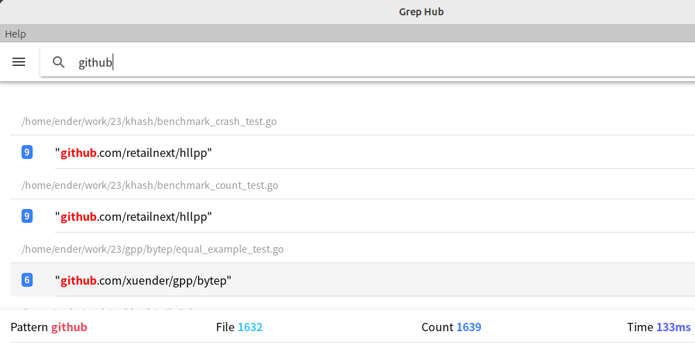

# grephub

[![Action][action-svg]][action-url]
[![Report Card][goreport-svg]][goreport-url]
[![Lines of code][lines-svg]][lines-url]
[![godoc][godoc-svg]][godoc-url]
[![License][license-svg]][license-url]

✨ **`xuender/grephub` is a GUI that supports multiple popular search tools.**

- [ripgrep (rg)][rg-url]
- [ugrep (ug)][ug-url]
- [The Silver Searcher (ag)][ag-url]

## 🚀 Install

```shell
go install github.com/xuender/grephub@latest
```

## 💡 Usage




## 👤 Contributors

![Contributors][contributors-svg]

## 📝 License

© ender, 2023~time.Now

[MIT LICENSE][license-url]

[action-url]: https://github.com/xuender/grephub/actions
[action-svg]: https://github.com/xuender/grephub/workflows/Go/badge.svg
[goreport-url]: https://goreportcard.com/report/github.com/xuender/grephub
[goreport-svg]: https://goreportcard.com/badge/github.com/xuender/grephub
[godoc-url]: https://godoc.org/github.com/xuender/grephub
[godoc-svg]: https://godoc.org/github.com/xuender/grephub?status.svg
[license-url]: https://github.com/xuender/grephub/blob/master/LICENSE
[license-svg]: https://img.shields.io/badge/license-MIT-blue.svg
[contributors-svg]: https://contrib.rocks/image?repo=xuender/grephub
[lines-svg]: https://sloc.xyz/github/xuender/grephub
[lines-url]: https://github.com/boyter/scc
[rg-url]: https://github.com/BurntSushi/ripgrep
[ug-url]: https://github.com/Genivia/ugrep
[ag-url]: https://github.com/ggreer/the_silver_searcher
